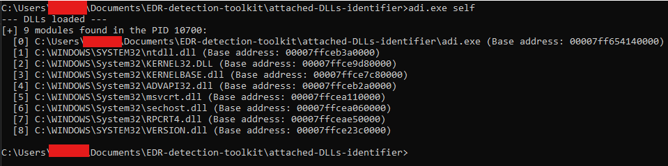
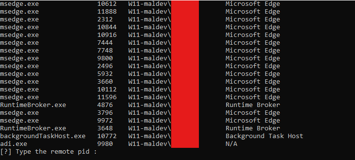

# AV/EDR detection toolkit
A collection of tools to identify AV/EDRs protections.
## Attached DLLs Identifier (ADI)
A tool to list DLLs attached to the program itself or a remote one, useful to identify AV/EDR hooker DLLs.
### Compilation
Compile with g++ to a static executable :
```
g++ adi.cpp -o adi.exe -lversion -static -static-libgcc -static-libstdc++
```
### Usage

List attached DLLs to the program :
```
adi.exe self
```



List every processes with PID and list attached DLLs to remote program :
```
adi.exe remote
```



Launch the program as Administrator to see SYSTEM's programs.
### Make it legit with metadatas
1. Modify the `ressource.rc` files with the metadatas you like to provide, add icon file in the same folder as the tool
2. Create the metadatas object file :
```
windres ressource.rc -O coff -o ressource.o
```
3. Compile with metadatas :
```
g++ adi.cpp ressource.o -o adi.exe -lversion -static -static-libgcc -static-libstdc++
```

